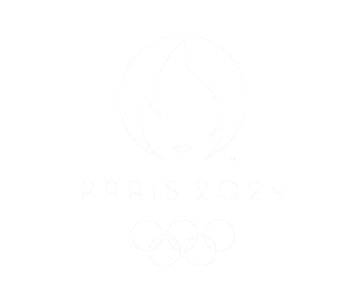

# Paris 2024 Olympics Dashboard

<p align="center">
  
</p>

**An interactive multi-page Streamlit dashboard for exploring the Paris 2024 Olympic Games data**

Built for the LA28 Volunteer Selection Challenge | ESI-SBA

---

## 🎯 Overview

This dashboard analyzes comprehensive data from the Paris 2024 Olympic Games, providing interactive insights into athlete performance, medal distributions, global trends, and event schedules.

**Key Features:**
- 7 interactive pages with 25+ visualizations
- Global filters (Country, Sport, Medal Type, Continent)
- Creative features: "Who Won the Day?", Head-to-Head comparison
- Professional dark mode UI with Paris 2024 Olympic colors

---

## 🚀 Quick Start

### Option 1: Docker (Recommended)

```bash
# Clone repository
git clone https://github.com/LokmaneBenhammadi/Paris-2024-Olympics-Dashboard.git
cd Paris-2024-Olympics-Dashboard

# Run with Docker Compose
docker-compose up --build

# Access at http://localhost:8501
```

### Option 2: Local Python

```bash
# Install dependencies
pip install -r requirements.txt

# Run app
streamlit run Overview.py
```

---

## 📁 Project Structure

```
streamlit_project/
├── Overview.py                 # Main entry point (Page 1: Overview)
├── pages/                      # Additional dashboard pages
│   ├── 2_Global_Analysis.py
│   ├── 3_Athlete_Performance.py
│   ├── 4_Sports_and_Events.py
│   ├── 5_Advanced_Analytics.py
│   ├── 6_Country_Comparison.py
│   └── 7_Follow_Your_Country.py
├── utils/                      # Reusable utility modules
│   ├── data_loader.py
│   ├── data_processor.py
│   ├── filters.py
│   ├── visualizations.py
│   ├── metrics.py
│   ├── continent_mapper.py
│   └── scrapping.ipynb
├── config/
│   └── config.py              # Global settings and colors
├── assets/
│   ├── logo.png
│   └── styles.css             # Custom CSS with animations
├── data/                      # CSV data files
├── requirements.txt
├── Dockerfile
├── docker-compose.yml
└── README.md
```

---

## 📄 Pages Description

### 🏠 **Page 1: Overview - The Command Center**
High-level summary with 5 KPI metrics, medal distribution pie chart, top 10 countries rankings, and interactive data table.

### 🗺️ **Page 2: Global Analysis - The World View**
World choropleth map, hierarchical sunburst/treemap (Continent → Country → Sport), and continental comparisons.

### 👤 **Page 3: Athlete Performance - The Human Story**
Searchable athlete profiles with photos, age/gender distributions, and top athletes leaderboard.

### 🏟️ **Page 4: Sports & Events - The Competition Arena**
Interactive Gantt chart for event schedules, medal treemap by sport, and venue map of Paris locations.

### ⭐ **Page 5: Advanced Analytics - Creativity Showcase**
Top countries by gender breakdown, multi-view athlete analysis, and **"Who Won the Day?"** daily timeline feature.

### ⚔️ **Page 6: Country Comparison - Head-to-Head Analysis**
Compare any two countries side-by-side with radar charts, medal timelines, and "What If?" scenario analysis.

### 🎌 **Page 7: Follow Your Country**
Personalized deep-dive for any country with complete performance dashboard and athlete roster.

---

## 🛠️ Utils Modules

### `data_loader.py`
Loads all CSV files with `@st.cache_data` for fast performance. Handles athletes, medals, events, schedules, venues, and 45 sport results.

### `data_processor.py`
Cleans and transforms data - normalizes column names, calculates ages, merges datasets, and handles missing values.

### `filters.py`
Creates global sidebar filters (continent, country, sport, medal type, gender, age). Auto-detects column names and applies filters to any dataframe.

### `visualizations.py`
Reusable Plotly chart functions - pie charts, bar charts, maps, sunbursts, treemaps, Gantt charts, radar charts, and more.

### `metrics.py`
Calculates KPIs - total athletes, countries, sports, medals, events. Respects active filters.

### `continent_mapper.py`
Maps 206 country codes to 6 continents. Adds continent columns to dataframes for regional analysis.

### `scrapping.ipynb`
Jupyter notebook for web scraping athlete profile images from [olympics.com/fr/athletes/](https://www.olympics.com/fr/athletes/).

---

## 📊 Data Sources

**Primary Dataset:** [Kaggle Paris 2024 Olympics](https://www.kaggle.com/datasets/piterfm/paris-2024-olympic-summer-games)

**Web Scraping:** Athlete profile photos scraped from [olympics.com/fr/athletes/](https://www.olympics.com/fr/athletes/) using the notebook in `utils/scrapping.ipynb`.

Place all CSV files in the `data/` folder:
- `athletes.csv`, `medals.csv`, `medals_total.csv`, `medallists.csv`
- `events.csv`, `schedules.csv`, `venues.csv`, `nocs.csv`
- `results/` folder with 45 sport-specific CSV files

---

## 🛠️ Technologies

- **Streamlit** - Web framework
- **Pandas** - Data processing
- **Plotly** - Interactive visualizations
- **Docker** - Containerization

---

## 🎨 Design Choices

**Color Scheme:** Paris 2024 Olympic palette (Pink `#FF6B9D`, Blue `#0085CA`, Gold/Silver/Bronze)

**Layout:** Progressive disclosure - overview first, then drill-down details

**Filters:** Global sidebar filters on every page for consistent UX

---

## 💡 Creative Features

1. **Continent Filter** - Map 206 countries to 6 continents
2. **"Who Won the Day?"** - Interactive daily timeline with medal awards
3. **Head-to-Head Tool** - Compare any two countries side-by-side
4. **Athlete Profiles** - Searchable cards with photos and coach info
5. **Animated Choropleth** - Time-lapse of medal accumulation

---

## 👥 Team

- BENHAMMADI Lokmane (Groupe 01)
- BELKAID Abderrahmane yassine hamza (Groupe 02)

---

## 📝 Competition Info

**Challenge:** LA28 Volunteer Selection - Paris 2024 Dashboard

**Institution:** ESI-SBA

**Instructor:** Dr. Belkacem KHALDI

---

## 🐳 Docker Commands

```bash
# Build and run
docker-compose up --build

# Stop
docker-compose down

# Rebuild after changes
docker-compose up --build --force-recreate

# View logs
docker-compose logs -f
```

---

## 📄 License

MIT License - Dataset from [Kaggle](https://www.kaggle.com/datasets/piterfm/paris-2024-olympic-summer-games)

---

## 🔗 Links

**Repository:** [Github Repo Link](https://github.com/LokmaneBenhammadi/Paris-2024-Olympics-Dashboard)

**Live Demo:** [Streamlit Cloud Link](https://paris-2024-olympics-dashboard.streamlit.app/)

**Video Demo:**

---